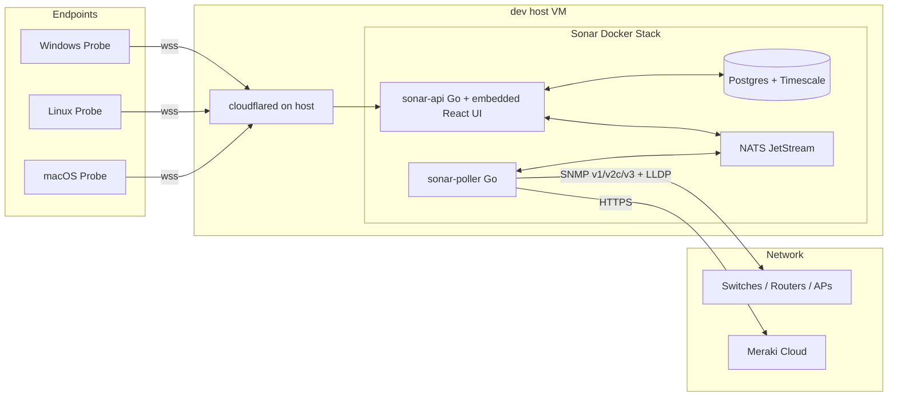

# ScanRay Sonar

Single-pane-of-visibility platform for the enterprise network: servers, switches, network health, EDR alerts, and traffic flows — all in one dark-themed web console.

Sonar is the third member of the **ScanRay** product line (alongside ScanRay Console and ScanRay Pupp). It is **standalone** — it does not depend on Console or Pupp — and is built Go-first with a small embedded React/TypeScript UI.

> **Status:** Phases 1–3 substantially shipped. The platform polls SNMP appliances, ingests endpoint telemetry from a cross-compiled Go probe, renders an LLDP/CDP topology, draws a per-agent network graph (host → process → ISP) with offline GeoIP, and pins every agent on a zoomable world map. Phases 4–6 (vendor/EDR integrations, full Traffic UI, hardening) are still ahead. See [Roadmap](#roadmap).

---

## Features

### Shipped today

- **Endpoint agent (`sonar-probe`)** — single Go binary cross-compiled for Linux/Windows/macOS (amd64 + arm64). Self-enrolls over WebSocket, then streams snapshots every 30 s with: CPU / memory / disk / NIC counters; **expanded top-process stats** (cpu %, mem %, disk-r/w bps, net-up/down bps, open conns); listeners + remote conversations (per-process, per-peer, with port set); DNS resolution telemetry; **hardware specs** (CPU model, RAM modules, motherboard / BIOS, disk model+serial, NICs, GPU, chassis — collected via DMI/SMBIOS on Linux and WMI on Windows); **public-IP discovery** via `icanhazip.com`; agent **tags** for GUI filtering.
- **Network appliances** — SNMP **v1, v2c, v3** poller covering IF-MIB (port + interface counters), ENTITY-MIB / ENTITY-SENSOR-MIB (chassis + transceiver DDM), LLDP and Cisco CDP (auto-topology). SNMP credentials encrypted at rest with the master key. Per-appliance polling goroutines compute deltas + bps rates in-memory.
- **Switch topology** — interactive force-directed graph of all managed appliances plus foreign neighbors discovered via LLDP/CDP, with Cisco IP-phone suppression, **physical-vs-virtual port** distinction, **uplink highlighting**, and last-seen timestamps. Pan + scroll-to-zoom; click any node to focus. A searchable **tag-filter dropdown** narrows the view (and is shared with the Agents and World pages).
- **Per-agent network graph** — two-tab view of every conversation the agent has open. The **Graph** tab is a deterministic radial layout (host center → processes inner ring → ISP / providers outer ring) with optional endpoints tier and a node-detail panel that answers "which providers does this process talk to" / "which processes touch this ISP." The **Map** tab plots the same peers on a zoomable world map, with great-circle lines from the agent to each peer (when the agent's own GeoIP is known), inbound vs. outbound colouring, automatic clustering at low zoom, and a side panel listing peers without a fix (private networks, anycast). All filters (Direction, Scope, Process) are shared between the two tabs. Built from the snapshot's conversation list, enriched offline with MaxMind GeoLite2 (City + ASN).
- **World map** — zoomable, clickable world map (`react-simple-maps` + bundled `world-110m.json`) plotting every agent at its public-IP location, with country / city / ASN labels.
- **Multi-site** + **RBAC** (`superadmin`/`siteadmin`/`tech`/`readonly`) + Argon2id local accounts + TOTP MFA; full **CRUD UI for users, sites, and appliances** (delete, not just disable).
- **Encrypted secrets at rest** via AES-256-GCM envelope encryption — per-row data keys wrapped by `SONAR_MASTER_KEY`.
- **OpenAPI 3.1** source-of-truth at [`/api/v1/openapi.yaml`](internal/api/openapi.yaml); **WebSocket-first** for agent ingest and UI live updates.
- **CalVer** versioning (`YYYY.M.D.patch`), shown on the login screen and inside the app.
- **Cloudflare Tunnel**-friendly: every container binds `127.0.0.1` only; the host's cloudflared exposes `sonar.<domain>` and `ingest.<domain>`.

### Planned (see [Roadmap](#roadmap))

- IPMI / Redfish, RAID + SMART deep dives, EDR/Sysmon event ingest, certificate inventory, synthetic reachability, time drift, backup last-success, reboot / crash history.
- Vendor integrations: Meraki Dashboard API + webhook, Cisco / Aruba / Ubiquiti / MikroTik plugin interface, SNMP trap receiver on UDP 162.
- Traffic visualization: live per-host ribbon flow, site sankey/chord with LLDP-overlay link utilization, NetFlow / sFlow / IPFIX collector on UDP 2055/6343, optional eBPF (Linux) and ETW (Windows) byte-accurate flow capture.
- Universal Ctrl/Cmd-K search across hosts/IPs/CIDRs/ports/processes/DNS/ASNs.
- Alert rule editor, email + Slack/Teams channels, OIDC / Azure AD, signed agent self-update channel.

---

## Architecture



### Components

| Service          | Image                                                  | Purpose                                                    |
| ---------------- | ------------------------------------------------------ | ---------------------------------------------------------- |
| `sonar-api`      | `ghcr.io/nclgisa/scanray-sonar-api` (distroless)       | HTTP/WS API + embedded React UI; serves agent ingest, GeoIP-enriches conversations from a read-only volume mount |
| `sonar-poller`   | `ghcr.io/nclgisa/scanray-sonar-poller`                 | Network appliance polling (SNMP v1/v2c/v3, LLDP/CDP)       |
| `sonar-postgres` | `timescale/timescaledb:2.17-pg16`                      | Relational + time-series storage                           |
| `sonar-nats`     | `nats:2.10-alpine`                                     | JetStream message bus for fan-out                          |
| `sonar-probe`    | bare binary (Win/Linux/Mac, amd64+arm64), no container | Endpoint telemetry agent (built by `make probe-all`)       |

Named volumes:

| Volume          | Mounted by   | Purpose                                                                                        |
| --------------- | ------------ | ---------------------------------------------------------------------------------------------- |
| `sonar-pgdata`  | `sonar-postgres` | Postgres data dir                                                                          |
| `sonar-natsdata` | `sonar-nats`    | JetStream stream storage                                                                   |
| `sonar-geoip`   | `sonar-api`  | MaxMind `GeoLite2-City.mmdb` + `GeoLite2-ASN.mmdb` (read-only mount). Populated by `make refresh-geoip`. |

The web UI is **built once** with Vite and **embedded into `sonar-api`** via `go:embed` — no separate web container, no nginx. The API container is `gcr.io/distroless/static-debian12:nonroot` (no shell, no curl); use the `/api/v1/healthz` endpoint for upstream probes.

---

## Repository Layout

```
.
├── cmd/
│   ├── sonar-api/                # API + UI server entrypoint (distroless)
│   ├── sonar-poller/             # SNMP polling service
│   └── sonar-probe/              # Endpoint agent (cross-compiled, OS-specific runners)
├── docker/
│   ├── api.Dockerfile            # multi-stage: web build → go build → distroless
│   ├── poller.Dockerfile
│   ├── probe.Dockerfile          # optional Linux container build for the probe
│   └── local-ca.crt              # corporate CA bundle (skip-worktree, never committed populated)
├── internal/
│   ├── api/                      # HTTP + WS handlers, OpenAPI spec, embedded UI
│   │                             #   handlers_{agents,agent_telemetry,appliances,
│   │                             #   appliance_telemetry,auth,meta,probe,resources,topology}.go
│   ├── auth/                     # Argon2id, JWT, TOTP, RBAC
│   ├── config/                   # SONAR_* environment loader
│   ├── crypto/                   # AES-256-GCM envelope encryption + tests
│   ├── db/
│   │   └── migrations/           # versioned SQL migrations (0001 … 0006)
│   ├── geoip/                    # MaxMind .mmdb readers (City + ASN), offline lookups
│   ├── logging/                  # slog JSON setup
│   ├── poller/                   # per-appliance scheduler, rate calc, persistence
│   ├── probe/                    # probe-side collection: snapshot, hardware,
│   │                             #   process tracker, public IP, DNS cache, enrollment
│   ├── probebins/                # embedded probe binaries served from /api/v1/probe/...
│   ├── snmp/                     # SNMP client, IF-MIB / ENTITY / LLDP / CDP collection
│   └── version/                  # ldflag-injected build info
├── scripts/
│   ├── build-probe.sh            # cross-compile matrix → web/dist embed via probebins
│   ├── dev-bootstrap.sh          # generate fresh secrets into .env
│   ├── deploy.sh                 # wrapper for git pull + compose up --build on dev host
│   ├── inject-host-ca.sh         # bake corporate CA into docker/local-ca.crt
│   └── refresh-geoip.sh          # download MaxMind .mmdb into the sonar-geoip volume
├── web/                          # Vite + React + TS + Tailwind UI
│   ├── src/api/                  # typed REST + WS client, response types
│   ├── src/components/           # ForceGraph, AgentNetworkGraph, Layout, Sparkline, ErrorBoundary
│   ├── src/pages/                # Dashboard, Login, Agents, AgentDetail, Appliances,
│   │                             #   ApplianceDetail, Sites, Topology, Users, World
│   ├── src/lib/                  # format helpers
│   └── dist/                     # built artifacts — embed target for sonar-api
├── .github/workflows/            # ci.yml, release.yml
├── docker-compose.yml
├── Makefile
├── VERSION                       # CalVer source of truth
└── README.md
```

---

## Quick Start (Local Development)

Prerequisites: Go 1.23+, Node 20+, Docker (for Postgres + NATS), `openssl` for the bootstrap script.

### 1. Generate `.env` and start dependencies

```bash
bash scripts/dev-bootstrap.sh        # writes .env with random secrets
docker compose up -d sonar-postgres sonar-nats
```

### 2. Build the UI once and run the API

```bash
cd web && npm install && npm run build && cd ..

set -a; source .env; set +a
SONAR_DB_HOST=127.0.0.1 SONAR_NATS_URL=nats://127.0.0.1:4222 \
  go run ./cmd/sonar-api
```

Open <http://localhost:6969> (or `http://<dev-host>:6969` from anywhere on the LAN) and sign in as the bootstrap admin (the script printed the password).

> The API is published on the host as `${SONAR_API_BIND}:${SONAR_API_PORT}` — defaults `0.0.0.0:6969`. Inside the container it still listens on `0.0.0.0:8080`. Port 8080 is intentionally avoided because it's taken on the `dev` host by an unrelated service. To restrict the UI to the host (cloudflared-only), set `SONAR_API_BIND=127.0.0.1` in `.env` and recreate the container.

### 3. (Optional) Populate the MaxMind GeoIP databases

Skip this for first-light dev work; without it, the World map and the agent network graph still render but ASN / city / country labels show "unknown".

```bash
# .env must already have MAXMIND_ACCOUNT_ID and MAXMIND_LICENSE_KEY
make refresh-geoip
docker compose restart sonar-api      # API loads .mmdb files at startup
```

`make refresh-geoip` downloads `GeoLite2-City.mmdb` and `GeoLite2-ASN.mmdb` into the `sonar-geoip` named volume. Re-run it weekly (MaxMind updates the free databases on Tuesdays) — easiest via cron:

```cron
17 4 * * 2 cd /opt/scanraysonar && /usr/bin/make refresh-geoip && /usr/bin/docker compose restart sonar-api
```

### 4. Build the probe binaries

```bash
make probe-all                        # cross-compiles linux/windows/darwin × amd64/arm64
```

The output drops into `internal/probebins/`, which is `go:embed`-ed into the API. The login screen's "Add an agent" panel then serves install one-liners that pull the right binary directly from `/api/v1/probe/install/...`.

### 5. UI hot-reload (optional, parallel terminal)

```bash
cd web && npm run dev   # http://127.0.0.1:5173 with /api proxy to :6969
```

### Run tests

```bash
go test ./... -race -count=1
```

---

## Production Deployment (`dev` host via Tendril)

The deployment target is the `dev` host VM, managed via the **currituck-tendril** root. Cloudflared runs **on the host**, not in this stack.

### One-time host setup

1. Clone the repo to `/opt/scanraysonar/`.
2. Run `bash scripts/dev-bootstrap.sh` (or copy `.env.example` → `.env` and fill in real secrets). Make sure `MAXMIND_ACCOUNT_ID` and `MAXMIND_LICENSE_KEY` are populated if you want GeoIP-enriched agent topology / world map.
3. **If the host is behind a TLS-inspecting corporate proxy** (e.g. Currituck's Tripwire SASE), run `bash scripts/inject-host-ca.sh` once. This bakes the host's trusted CA bundle into `docker/local-ca.crt` so `npm ci` and `go mod download` can validate TLS inside the build containers. The script also marks the file `--skip-worktree`, so populated CA content can never accidentally be committed upstream.
4. Populate the GeoIP volume (skip if you don't have a MaxMind license):
   ```bash
   make refresh-geoip
   ```
5. Add two ingress entries to the host's existing `cloudflared` config:
   ```yaml
   ingress:
     - hostname: sonar.<domain>
       service: http://127.0.0.1:6969
     - hostname: ingest.<domain>
       service: http://127.0.0.1:6969
       originRequest:
         noTLSVerify: true
     # ...existing catch-all 404
   ```
6. In Cloudflare Zero Trust, add an **Access policy** for `sonar.<domain>` (e.g. `email-domain in {currituckcountync.gov}`). Leave `ingest.<domain>` open — agents authenticate via signed JWT, not via Access.
7. (Recommended) Add a weekly cron entry to keep the MaxMind databases current:
   ```cron
   17 4 * * 2 cd /opt/scanraysonar && /usr/bin/make refresh-geoip && /usr/bin/docker compose restart sonar-api
   ```

### Recurring deploy

From your workstation, via Tendril:

```
agent: dev
script: cd /opt/scanraysonar && ./scripts/deploy.sh
timeout: 600
```

`deploy.sh` runs `git pull`, then `docker compose pull && up -d --build`.

---

## Versioning (CalVer)

Format: `YYYY.M.D.patch` — e.g. `2026.4.26.12`. The single source of truth is the [`VERSION`](VERSION) file. CI reads it and injects it into all binaries via `-ldflags`. The same string is also rendered on the login screen and inside the app shell so operators can see at a glance what's deployed.

To bump, update **four** files in lockstep:

```powershell
# Windows / PowerShell
$v = "2026.4.27.1"
$v | Set-Content -NoNewline VERSION

# Then update the matching strings in:
#   web/package.json                    ("version": "$v")
#   web/src/components/Layout.tsx       (const APP_VERSION = "$v")
#   internal/api/openapi.yaml           (info.version: "$v")

git tag "v$v" && git push --tags
```

The tag push triggers `.github/workflows/release.yml`, which builds + signs container images to GHCR and uploads probe binaries to the GitHub Release.

---

## Security Model

- **Secrets at rest** — every `enc_*` column is sealed with AES-256-GCM. Per-row data keys wrap the actual ciphertext; the data keys themselves are wrapped by `SONAR_MASTER_KEY` (32 random bytes, base64). Loss of the master key = loss of every secret. Back it up offline.
- **User auth** — Argon2id (PHC string, parameters embedded so cost can be raised over time) + mandatory TOTP MFA for admins (Phase 2 ships the enrollment UI).
- **Tokens** — short-lived HS256 access JWT (15m) + refresh JWT (30d) with `kind` claim so a refresh can never be used as an access token.
- **RBAC** — coarse roles (`superadmin`/`siteadmin`/`tech`/`readonly`) compared via numeric rank; never compare role strings directly.
- **Audit log** — append-only `audit_log` table records every login, role grant, secret read, alert ack, and admin action.
- **Network exposure** — no compose port is published outside `127.0.0.1`. Public access is exclusively via the host's Cloudflare Tunnel.
- **Agent ingest** — `ingest.<domain>` is unauthenticated at the CF Access layer (machines can't sign in) but every websocket upgrade requires a signed agent JWT bound to the host fingerprint.

---

## Configuration

All settings come from environment variables prefixed `SONAR_`. See [`.env.example`](.env.example) for the full list.

### Required

| Variable                | Purpose                                                                |
| ----------------------- | ---------------------------------------------------------------------- |
| `SONAR_MASTER_KEY`      | 32 bytes base64 — wraps every database secret                          |
| `SONAR_JWT_SECRET`      | 64 bytes base64 — signs access + refresh tokens                        |
| `SONAR_DB_PASSWORD`     | Postgres password                                                      |
| `SONAR_PUBLIC_URL`      | Public hostname for the UI (e.g. `https://sonar.example.com`) — used in CORS |
| `SONAR_INGEST_URL`      | Public hostname for agent ingest (e.g. `https://ingest.example.com`) — embedded in install one-liners |

### Common optional

| Variable                                     | Purpose                                                                |
| -------------------------------------------- | ---------------------------------------------------------------------- |
| `SONAR_API_BIND` / `SONAR_API_PORT`          | Host interface + port for the published UI (defaults `0.0.0.0:6969`; set bind to `127.0.0.1` for cloudflared-only) |
| `SONAR_BOOTSTRAP_ADMIN_EMAIL` / `_PASSWORD`  | First-run admin (only used if no users exist)                          |
| `SONAR_JWT_ACCESS_TTL` / `_REFRESH_TTL`      | Token lifetimes (default 15 m / 30 d)                                  |
| `SONAR_SMTP_*`                               | Outbound email for alerts (Phase 4 alerting will consume these)        |

### MaxMind / GeoIP

The API enriches agent conversations with country / city / ASN / org using two MaxMind GeoLite2 `.mmdb` files mounted read-only at `/var/lib/sonar/geoip` from the `sonar-geoip` volume. Lookups are offline, in-process, and cached on the agent row — no per-request HTTP calls. Without these files, the World map and agent network graph still work but pin everything at "unknown."

| Variable                | Purpose                                                                |
| ----------------------- | ---------------------------------------------------------------------- |
| `MAXMIND_ACCOUNT_ID`    | Account ID from your MaxMind GeoIP2 account — read by `scripts/refresh-geoip.sh` |
| `MAXMIND_LICENSE_KEY`   | License key from the same account                                      |
| `SONAR_GEOIP_CITY_DB`   | Path inside the API container (default `/var/lib/sonar/geoip/GeoLite2-City.mmdb`) |
| `SONAR_GEOIP_ASN_DB`    | Path inside the API container (default `/var/lib/sonar/geoip/GeoLite2-ASN.mmdb`)  |

Refresh the databases with `make refresh-geoip` and restart `sonar-api` to pick them up.

---

## Roadmap

- **Phase 1 — Foundation** ✅
  Repo, compose stack, Postgres + Timescale, OpenAPI 3.1, JWT / MFA / RBAC, multi-site, AES-256-GCM envelope encryption, host-side Cloudflare Tunnel wiring, CalVer.
- **Phase 2 — Probe v1** ✅ (core shipped)
  Cross-compiled Go agent with self-enrollment + WebSocket ingest. Collects: system / disk / NIC, expanded top-process stats (cpu %, mem %, disk-r/w, net-up/down, open conns), listeners + remote conversations (per-process, per-peer, port set), DNS resolution telemetry, hardware specs (DMI/SMBIOS/WMI), public-IP discovery via `icanhazip.com`. Agent **tagging** + GUI filtering. Per-agent radial network graph (host → process → ISP) with offline GeoIP. World map of agents.
  *Still TODO for Phase 2:* IPMI / Redfish, RAID + SMART, failed services, pending reboots, backup-last-success, time drift, cert inventory, security posture, EDR/Sysmon presence + events, GPU/UPS, containers/VMs, synthetic checks, reboot/crash history.
- **Phase 3 — Network module** ✅ (core shipped)
  SNMP v1/v2c/v3 poller, IF-MIB (port stats), ENTITY-MIB / ENTITY-SENSOR-MIB (chassis + transceiver DDM), LLDP + CDP auto-topology with Cisco IP-phone suppression, **physical-vs-virtual port** distinction, **uplink highlighting**, last-seen tracking, full appliance + site CRUD, encrypted SNMP credentials.
  *Still TODO for Phase 3:* live SNMP link-utilization overlay on the topology, SNMP trap receiver on UDP 162.
- **Phase 4 — Vendor + EDR**
  Meraki Dashboard API + webhook receiver, Cisco / Aruba / Ubiquiti / MikroTik plugin interface, EDR/Sysmon presence + event ingest, alert rule editor UI, email + webhook (Slack / Teams) channels.
- **Phase 5 — Traffic visualization**
  Universal Ctrl/Cmd-K Traffic search (hosts / IPs / CIDRs / ports / processes / DNS / ASNs), per-host live ribbon flow, site sankey / chord with link-utilization overlay, NetFlow / sFlow / IPFIX collector on UDP 2055/6343, optional eBPF (Linux) and ETW (Windows) byte-accurate flow collection, saved searches.
- **Phase 6 — Polish**
  Signed agent self-update channel, OIDC / Azure AD, full OpenAPI docs polish, hardening + load test.

---

## Contributing

This is a small internal project. PRs welcome from authorized contributors. Conventions:

- `gofmt -s` + `go vet` clean before pushing.
- `go test ./... -race` green.
- One CalVer bump per release; PRs targeting `main` should not bump VERSION.
- Comments explain *why*, not *what*. The code says what.

## License

MIT — see [LICENSE](LICENSE).
