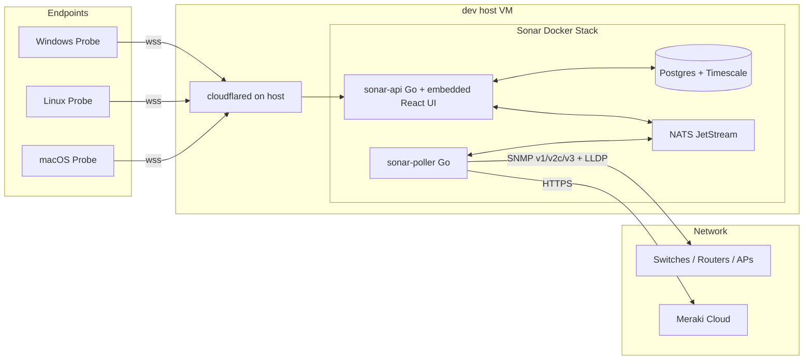

# ScanRay Sonar

Single-pane-of-visibility platform for the enterprise network: servers, switches, network health, EDR alerts, and traffic flows — all in one dark-themed web console.

Sonar is the third member of the **ScanRay** product line (alongside ScanRay Console and ScanRay Pupp). It is **standalone** — it does not depend on Console or Pupp — and is built Go-first with a small embedded React/TypeScript UI.

> **Status:** Phase 1 (Foundation) complete. Phases 2–6 add the Probe agent, network polling, vendor + EDR integrations, traffic visualization, and polish. See [Roadmap](#roadmap).

---

## Features (target)

- **Servers** — agent-pushed metrics: CPU/mem/disk/SMART, NIC counters, top processes, IPMI/Redfish hardware health, RAID status, failed services, pending reboots, backup last-success, time drift, certificate inventory, security posture, EDR/Sysmon presence + events, GPU/UPS metrics, container/VM inventory, synthetic reachability checks, **DNS resolution telemetry**, reboot/crash history.
- **Network appliances** — SNMP **v1, v2c, and v3** universal poller covering IF-MIB (port stats), ENTITY-SENSOR-MIB (transceiver DDM), LLDP/CDP (auto topology). Vendor modules: Meraki Dashboard API, plus Cisco/Aruba/Ubiquiti/MikroTik plugin interface. SNMP trap receiver on UDP 162.
- **Traffic visualization** — three views with a universal Ctrl/Cmd-K search:
  1. Live Flow Stream — Ubiquiti-style ribbons per host, fed by Probe (gopsutil + optional eBPF/ETW).
  2. Site Flow Map — sankey/chord across the whole site with LLDP-overlay link utilization.
  3. NetFlow / sFlow / IPFIX collector on UDP 2055/6343 for native flow exports.
- **Multi-site** with site selector, RBAC (`superadmin`/`siteadmin`/`tech`/`readonly`), and Argon2id local accounts + TOTP MFA.
- **Encrypted secrets** at rest via AES-256-GCM envelope encryption (per-row data keys wrapped by a master key).
- **OpenAPI 3.1** source-of-truth at [`/api/v1/openapi.yaml`](internal/api/openapi.yaml).
- **WebSocket-first** for agent ingest and UI live updates.
- **CalVer** versioning: `YYYY.M.D.patch`.
- **Cloudflare Tunnel**-friendly: every container binds `127.0.0.1` only; the host's cloudflared exposes `sonar.<domain>` and `ingest.<domain>`.

---

## Architecture



### Components

| Service          | Image                                                  | Purpose                                            |
| ---------------- | ------------------------------------------------------ | -------------------------------------------------- |
| `sonar-api`      | `ghcr.io/nclgisa/scanray-sonar-api`                    | HTTP/WS API + embedded React UI                    |
| `sonar-poller`   | `ghcr.io/nclgisa/scanray-sonar-poller`                 | Network appliance polling (SNMP/LLDP/Meraki/flows) |
| `sonar-postgres` | `timescale/timescaledb:2.17-pg16`                      | Relational + time-series storage                   |
| `sonar-nats`     | `nats:2.10-alpine`                                     | JetStream message bus for fan-out                  |
| `sonar-probe`    | bare binary (Win/Linux/Mac, amd64+arm64), no container | Endpoint telemetry agent (Phase 2)                 |

The web UI is **built once** with Vite and **embedded into `sonar-api`** via `go:embed` — no separate web container, no nginx.

---

## Repository Layout

```
.
├── api/                          (none — spec lives in internal/api/openapi.yaml)
├── cmd/
│   ├── sonar-api/                # API + UI server entrypoint
│   ├── sonar-poller/             # Network polling service
│   └── sonar-probe/              # Endpoint agent (cross-compiled)
├── docker/
│   ├── api.Dockerfile
│   ├── poller.Dockerfile
│   └── probe.Dockerfile          # optional Linux container build
├── internal/
│   ├── api/                      # HTTP + WS handlers, OpenAPI spec, embed
│   ├── auth/                     # Argon2id, JWT, TOTP, RBAC
│   ├── config/                   # SONAR_* environment loader
│   ├── crypto/                   # AES-256-GCM envelope encryption + tests
│   ├── db/                       # pgxpool + golang-migrate + bootstrap
│   │   └── migrations/           # versioned SQL migrations
│   ├── logging/                  # slog JSON setup
│   └── version/                  # ldflag-injected build info
├── scripts/
│   ├── build-probe.sh            # cross-compile matrix
│   ├── dev-bootstrap.sh          # generate fresh secrets into .env
│   └── deploy.sh                 # wrapper for compose pull + up on dev host
├── web/                          # Vite + React + TS + Tailwind UI
│   └── dist/                     # placeholder + built artifacts (embed target)
├── .github/workflows/            # CI + release pipelines
├── docker-compose.yml
├── Makefile
├── VERSION                       # CalVer source of truth
└── README.md
```

---

## Quick Start (Local Development)

Prerequisites: Go 1.23+, Node 20+, Docker (for Postgres + NATS), `openssl` for the bootstrap script.

### 1. Generate `.env` and start dependencies

```bash
bash scripts/dev-bootstrap.sh        # writes .env with random secrets
docker compose up -d sonar-postgres sonar-nats
```

### 2. Build the UI once and run the API

```bash
cd web && npm install && npm run build && cd ..

set -a; source .env; set +a
SONAR_DB_HOST=127.0.0.1 SONAR_NATS_URL=nats://127.0.0.1:4222 \
  go run ./cmd/sonar-api
```

Open <http://127.0.0.1:8080> and sign in as the bootstrap admin (the script printed the password).

### 3. UI hot-reload (optional, parallel terminal)

```bash
cd web && npm run dev   # http://127.0.0.1:5173 with /api proxy to :8080
```

### Run tests

```bash
go test ./... -race -count=1
```

---

## Production Deployment (`dev` host via Tendril)

The deployment target is the `dev` host VM, managed via the **currituck-tendril** root. Cloudflared runs **on the host**, not in this stack.

### One-time host setup

1. Clone the repo to `/opt/scanraysonar/`.
2. Run `bash scripts/dev-bootstrap.sh` (or copy `.env.example` → `.env` and fill in real secrets).
3. Add two ingress entries to the host's existing `cloudflared` config:
   ```yaml
   ingress:
     - hostname: sonar.<domain>
       service: http://127.0.0.1:8080
     - hostname: ingest.<domain>
       service: http://127.0.0.1:8080
       originRequest:
         noTLSVerify: true
     # ...existing catch-all 404
   ```
4. In Cloudflare Zero Trust, add an **Access policy** for `sonar.<domain>` (e.g. `email-domain in {currituckcountync.gov}`). Leave `ingest.<domain>` open — agents authenticate via signed JWT, not via Access.

### Recurring deploy

From your workstation, via Tendril:

```
agent: dev
script: cd /opt/scanraysonar && ./scripts/deploy.sh
timeout: 600
```

`deploy.sh` runs `git pull`, then `docker compose pull && up -d --build`.

---

## Versioning (CalVer)

Format: `YYYY.M.D.patch` — e.g. `2026.4.24.1`. The single source of truth is the [`VERSION`](VERSION) file. CI reads it and injects it into all binaries via `-ldflags`.

To bump:

```powershell
# Windows / PowerShell
"2026.4.25.1" | Set-Content -NoNewline VERSION

# Update the matching strings in:
#   web/package.json           ("version": "2026.4.25.1")
#   web/src/components/Layout.tsx (APP_VERSION constant)
#   internal/api/openapi.yaml  (info.version)
git tag v2026.4.25.1 && git push --tags
```

The tag push triggers `.github/workflows/release.yml` which builds + signs container images to GHCR and uploads probe binaries to the GitHub Release.

---

## Security Model

- **Secrets at rest** — every `enc_*` column is sealed with AES-256-GCM. Per-row data keys wrap the actual ciphertext; the data keys themselves are wrapped by `SONAR_MASTER_KEY` (32 random bytes, base64). Loss of the master key = loss of every secret. Back it up offline.
- **User auth** — Argon2id (PHC string, parameters embedded so cost can be raised over time) + mandatory TOTP MFA for admins (Phase 2 ships the enrollment UI).
- **Tokens** — short-lived HS256 access JWT (15m) + refresh JWT (30d) with `kind` claim so a refresh can never be used as an access token.
- **RBAC** — coarse roles (`superadmin`/`siteadmin`/`tech`/`readonly`) compared via numeric rank; never compare role strings directly.
- **Audit log** — append-only `audit_log` table records every login, role grant, secret read, alert ack, and admin action.
- **Network exposure** — no compose port is published outside `127.0.0.1`. Public access is exclusively via the host's Cloudflare Tunnel.
- **Agent ingest** — `ingest.<domain>` is unauthenticated at the CF Access layer (machines can't sign in) but every websocket upgrade requires a signed agent JWT bound to the host fingerprint.

---

## Configuration

All settings come from environment variables prefixed `SONAR_`. See [`.env.example`](.env.example) for the full list. The required ones:

| Variable                | Purpose                                                                |
| ----------------------- | ---------------------------------------------------------------------- |
| `SONAR_MASTER_KEY`      | 32 bytes base64 — wraps every database secret                          |
| `SONAR_JWT_SECRET`      | 64 bytes base64 — signs access + refresh tokens                        |
| `SONAR_DB_PASSWORD`     | Postgres password                                                      |
| `SONAR_PUBLIC_URL`      | Public hostname (e.g. `https://sonar.example.com`) — used in CORS      |
| `SONAR_BOOTSTRAP_ADMIN_EMAIL` / `_PASSWORD` | Optional first-run admin (only used if no users exist) |

---

## Roadmap

- **Phase 1 — Foundation** ✅
  Repo, compose stack, Postgres + Timescale, OpenAPI 3.1 skeleton, JWT/MFA/RBAC, multi-site, AES-256-GCM envelope encryption, host-side Cloudflare Tunnel wiring, CalVer.
- **Phase 2 — Probe v1**
  Cross-compiled Go agent with enrollment + websocket ingest. Collects: system/disk/NIC, top processes, IPMI/RAID/SMART, failed services, pending reboots, backup-last-success, time drift, cert inventory, security posture, EDR/Sysmon, GPU/UPS, containers/VMs, synthetic checks, **DNS resolution telemetry + DNS tab**, reboot/crash history.
- **Phase 3 — Network module**
  SNMP v1/v2c/v3 poller, IF-MIB / ENTITY-SENSOR-MIB / LLDP/CDP, transceiver/DDM view, ReactFlow auto-topology with live SNMP link-utilization overlay, SNMP trap receiver.
- **Phase 4 — Vendor + EDR**
  Meraki Dashboard API + webhook receiver, EDR/Sysmon presence + event ingest, alert rule editor UI, email + webhook (Slack/Teams) channels.
- **Phase 5 — Traffic visualization**
  Universal Ctrl/Cmd-K Traffic search (hosts/IPs/CIDRs/ports/processes/DNS/ASNs), per-host live ribbon flow, site sankey/chord with link-utilization overlay, NetFlow/sFlow/IPFIX collector, optional eBPF (Linux) and ETW (Windows) byte-accurate flow collection, saved searches.
- **Phase 6 — Polish**
  Signed agent self-update channel, OIDC/Azure AD, full README + OpenAPI docs polish, hardening + load test.

---

## Contributing

This is a small internal project. PRs welcome from authorized contributors. Conventions:

- `gofmt -s` + `go vet` clean before pushing.
- `go test ./... -race` green.
- One CalVer bump per release; PRs targeting `main` should not bump VERSION.
- Comments explain *why*, not *what*. The code says what.

## License

MIT — see [LICENSE](LICENSE).
