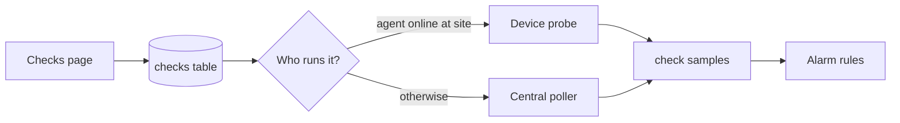

# Checks

**Checks** are synthetic monitors you attach to a site: ping a host, open a TCP port, fetch a URL, resolve DNS, or inspect a TLS certificate. They sit **beside** appliance SNMP, Meraki sync, and device (probe) health — they do not replace those.

Use checks when you need “is this service reachable / healthy from here?” rather than “what is this switch’s SNMP snapshot?”

## Who can do what

| Role | Checks |
|------|--------|
| **siteadmin** / **superadmin** | Create, edit, enable/disable, delete |
| **tech** and above | View the Checks list and status |

## How it works



1. You create a check with a **type**, **target** (host/URL/port), **site**, and **runner** preference.
2. Sonar schedules it (default every 60 seconds; minimum 15).
3. **Runner selection (agent first):**
   - **auto** (default) — if any enrolled [device](devices.md) at that site was seen in the last ~2 minutes, the **probe** runs the check; otherwise the **central poller** runs it.
   - **agent** — prefer a specific probe (or any online probe at the site); fall back to central if none are available.
   - **central** — always run on the Sonar poller.
4. Each run writes channel samples (latency, up/down, status code, days to cert expiry, and so on).
5. Seeded [alarm](alarms.md) rules with target kind **check** can open alarms from those values.

!!! tip "Where the check runs from"
    The runner’s network path matters. A probe at a remote site can ping LAN targets the Sonar server cannot reach. A central check can only hit targets the poller container/host can route to (public URLs, VPN-connected networks, etc.).

## Setup (UI)

### 1. Open Checks

In the left sidebar, open **Checks**.

### 2. Create a check

Fill in:

| Field | What to enter |
|-------|----------------|
| **Site** | Site this check belongs to |
| **Type** | `icmp`, `tcp`, `http`, `dns`, or `tls` (see below) |
| **Runner** | Usually leave **auto (agent first)** |
| **Name** | Optional label (defaults from type + target) |
| **Host / URL / Port** | Depends on type |

Click **Add check**.

### 3. Shortcuts from inventory

- On an [appliance](appliances.md) detail page, use **Add check** — pre-fills site, appliance id, and management IP (ICMP).
- On a [device](devices.md) detail page, use **Add check (agent runner)** — pre-fills site and agent id so the probe is preferred.

### 4. Day-to-day

- **Status** column: `pending` (not run yet), `ok`, or `fail` (hover fail for the last error).
- **Disable** / **Enable** to pause without deleting.
- **Delete** removes the check and its samples.

## Check types

### ICMP (`icmp`)

| Param | Required | Notes |
|-------|----------|--------|
| Host | Yes | Hostname or IPv4 |
| Timeout / echo count | No | Defaults are fine for most uses |

**Channels:** response time (ms), packet loss (%), up (1/0).

**Needs:** ICMP echo allowed from the runner (probe or poller). Restricted networks may block outbound ping.

### TCP (`tcp`)

| Param | Required | Notes |
|-------|----------|--------|
| Host | Yes | |
| Port | Yes | e.g. `443`, `22`, `3389` |

**Channels:** response time (ms), up (1/0).

### HTTP (`http`)

| Param | Required | Notes |
|-------|----------|--------|
| URL | Yes | Full URL, e.g. `https://intranet.example.com/health` |

**Channels:** response time (ms), HTTP status code, up (1/0).  
Up is true when status is the expected code (default **200**) or, if expect is 200, any 2xx/3xx.

!!! note
    TLS certificate validity is **not** the goal of this type (handshake errors still fail the check). Use **tls** for days-to-expiry and name match.

### DNS (`dns`)

| Param | Required | Notes |
|-------|----------|--------|
| Host | Yes | Name to resolve |
| Record type | No | Default `A` (`AAAA` / `CNAME` also supported) |
| Resolver | No | Optional DNS server IP; empty = system resolver |

**Channels:** response time (ms), record count, up (1/0).

### TLS (`tls`)

| Param | Required | Notes |
|-------|----------|--------|
| Host | Yes | Hostname to connect to |
| Port | No | Default `443` |
| SNI | No | Defaults to host |

**Channels:** days to expiration, CN/SAN match (1/0), up (1/0).

## Alarms (defaults)

Sonar seeds check-oriented rules such as:

| Rule idea | Expression style |
|-----------|------------------|
| ICMP packet loss | `device.icmp_packet_loss_pct > 0` |
| ICMP latency high | `device.icmp_response_time_ms > 500` |
| TCP / HTTP / DNS down | `device.tcp_up != 1` (and similar for `http_up`, `dns_up`) |
| TLS expiring soon | `device.tls_days_to_expiration < 28` |
| TLS handshake failed | `device.tls_up != 1` |

Review and tune them under **Alarms** → rules. Target kind for these is **check**. Wire [notification channels](settings.md) if you want email/webhook delivery.

## Recommended setups

| Goal | Suggested check |
|------|-----------------|
| “Is the firewall/gateway up from the site LAN?” | ICMP or TCP from a **probe** at that site (`auto` or `agent`) |
| “Is the public website answering?” | HTTP or TLS with runner **central** (or auto with no site probe) |
| “Will our cert expire?” | TLS on the public hostname; leave seeded expiry alarm |
| “Is DNS resolving for users?” | DNS for an important internal name; prefer **agent** at that site |

## Troubleshooting

| Symptom | What to check |
|---------|----------------|
| Always `fail` / connection refused | Target must be reachable **from the runner**. Central cannot use `127.0.0.1` of your laptop — use a hostname the poller can reach. |
| Stays `pending` | Wait one interval; confirm poller (and probe, if agent-run) are up. |
| Agent never runs `auto` checks | Device must be enrolled, active, and heartbeating (`last seen` within ~2 minutes) on the **same site**. |
| ICMP fails, TCP works | ICMP blocked; use TCP on a known open port instead. |
| HTTP fails with TLS errors | Wrong URL scheme/host, or server requires SNI — try **tls** type for cert issues. |

## API (optional)

For automation (siteadmin+ to mutate):

- `GET /api/v1/check-types` — catalog of types and parameter schemas  
- `GET /api/v1/checks` — list (`?siteId=` optional)  
- `POST /api/v1/checks` — create  
- `PATCH` / `DELETE /api/v1/checks/{id}`  
- `GET /api/v1/checks/{id}/samples` — recent channel samples  

See the OpenAPI download from the UI/API for full schemas.

## What Checks are not

- Not a replacement for [appliance](appliances.md) SNMP / OID packs or Meraki Dashboard sync  
- Not a replacement for [device](devices.md) CPU/memory/disk/DEX telemetry (the probe already reports that)  
- Not remote WMI, SQL, cloud APIs, or custom scripts (later phases)

## For Sonar maintainers

Check type definitions are embedded JSON under `internal/checks/catalog/`. To regenerate after updating a local reference catalog:

```bash
python scripts/build-checkpacks.py
```

Operator-facing IDs stay Sonar-native (`icmp`, `http`, `tls`, …).
