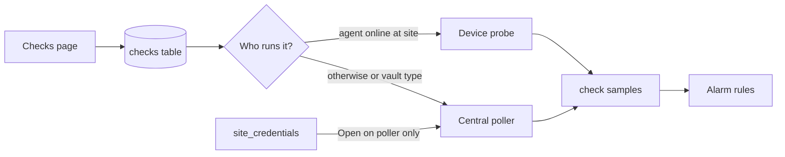

# Checks

**Checks** are synthetic monitors you attach to a site: ping a host, open a TCP port, fetch a URL, resolve DNS, inspect a TLS certificate, or (vault-backed) probe SQL / SMTP / IMAP / LDAP. They sit **beside** appliance SNMP, Meraki sync, and device (probe) health — they do not replace those.

Use checks when you need “is this service reachable / healthy from here?” rather than “what is this switch’s SNMP snapshot?”

## Who can do what

| Role | Checks |
|------|--------|
| **siteadmin** / **superadmin** | Create, edit, enable/disable, delete |
| **tech** and above | View the Checks list and status |

## How it works



1. You create a check with a **type**, **target** (host/URL/port/query), **site**, and **runner** preference.
2. For SQL / SMTP / IMAP / LDAP, pick a **site vault credential** (`credentialId`). Passwords are never stored in check params.
3. Sonar schedules it (default every 60 seconds; minimum 15).
4. **Runner selection:**
   - Phase-1 types (`icmp`, `tcp`, `http`, `dns`, `tls`): **auto** prefers an online probe; otherwise central.
   - Phase-4 types (`sql_query`, `smtp`, `imap`, `ldap_bind`): **always central** so secrets stay on the poller with `SONAR_MASTER_KEY`.
5. Each run writes channel samples; seeded alarm rules with target kind **check** can open alarms.

!!! tip "Where the check runs from"
    The runner’s network path matters. A probe at a remote site can ping LAN targets the Sonar server cannot reach. Vault-backed checks only run from the central poller — the target must be reachable from that host/container network.

## Setup (UI)

### 1. Open Checks

In the left sidebar, open **Checks**.

### 2. Create a check

Fill in:

| Field | What to enter |
|-------|----------------|
| **Site** | Site this check belongs to |
| **Type** | See types below |
| **Runner** | Usually **auto** for phase-1; locked to **central** for vault types |
| **Vault credential** | Required for SQL/SMTP/IMAP/LDAP — create under Sites → Discovery → credentials |
| **Host / URL / Port / Query** | Depends on type |

Click **Add check**.

### 3. Shortcuts from inventory

- On an [appliance](appliances.md) detail page, use **Add check** — pre-fills site, appliance id, and management IP (ICMP).
- On a [device](devices.md) detail page, use **Add check (agent runner)** — pre-fills site and agent id so the probe is preferred.

### 4. Day-to-day

- **Status** column: `pending` (not run yet), `ok`, or `fail` (hover fail for the last error).
- **Disable** / **Enable** to pause without deleting.
- **Delete** removes the check and its samples.

## Check types

### ICMP (`icmp`)

| Param | Required | Notes |
|-------|----------|--------|
| Host | Yes | Hostname or IPv4 |
| Timeout / echo count | No | Defaults are fine for most uses |

**Channels:** response time (ms), packet loss (%), up (1/0).

### TCP (`tcp`)

| Param | Required | Notes |
|-------|----------|--------|
| Host | Yes | |
| Port | Yes | e.g. `443`, `22`, `3389` |

**Channels:** response time (ms), up (1/0).

### HTTP (`http`)

| Param | Required | Notes |
|-------|----------|--------|
| URL | Yes | Full URL, e.g. `https://intranet.example.com/health` |

**Channels:** response time (ms), HTTP status code, up (1/0).

### DNS (`dns`)

| Param | Required | Notes |
|-------|----------|--------|
| Host | Yes | Name to resolve |
| Record type | No | Default `A` |
| Resolver | No | Optional DNS server IP |

**Channels:** response time (ms), record count, up (1/0).

### TLS (`tls`)

| Param | Required | Notes |
|-------|----------|--------|
| Host | Yes | |
| Port | No | Default `443` |
| SNI | No | Defaults to host |

**Channels:** days to expiration, CN/SAN match (1/0), up (1/0).

### SQL query (`sql_query`) — central only

| Param | Required | Notes |
|-------|----------|--------|
| Host / Port / Driver | Yes / No / No | `postgres` (default), `sqlserver`, `mysql` |
| Query | No | Single read-only `SELECT` / `WITH…SELECT` |
| Vault credential | Yes | Kind **sql** |

**Channels:** response time (ms), row count, up (1/0).

### SMTP (`smtp`) / IMAP (`imap`) — central only

Dial + AUTH. Vault kinds **smtp** / **imap**. SMTP may optionally MAIL FROM / RCPT TO without sending a body.

**Channels:** response time (ms), up (1/0); IMAP also mailbox count.

### LDAP bind (`ldap_bind`) — central only

Bind with vault **ldap** credentials (optional bind DN override, LDAPS).

**Channels:** response time (ms), up (1/0).

## Credentials (vault)

Create credentials under **Sites → Discovery → Manage credentials** with kinds `sql`, `ldap`, `smtp`, or `imap`. Secrets are envelope-encrypted with `SONAR_MASTER_KEY`. Checks store only `credentialId`. The API rejects password-like keys in `checks.params`.

## Alarms (defaults)

Seeded rules include ICMP/TCP/HTTP/DNS/TLS plus `sql_up`, `smtp_up`, `imap_up`, `ldap_up`, and `sql_response_time_ms > 5000`. Target kind is **check**.

## Troubleshooting

| Symptom | What to check |
|---------|----------------|
| Always `fail` | Target reachable from the runner (central for vault types). |
| Vault errors | Matching credential kind on same site; JSON has username/password. |
| Stays `pending` | Wait one interval; confirm poller is up. |

## API (optional)

- `GET /api/v1/check-types`
- `GET/POST /api/v1/checks` (include `credentialId` for vault types)
- `PATCH` / `DELETE /api/v1/checks/{id}`
- `GET /api/v1/checks/{id}/samples`

## What Checks are not

- Not a replacement for SNMP OID packs, Meraki, or device DEX
- Not remote WMI, SSH scripts, cloud APIs, or EXE runners (deferred)

## For Sonar maintainers

```bash
python scripts/build-checkpacks.py
```
